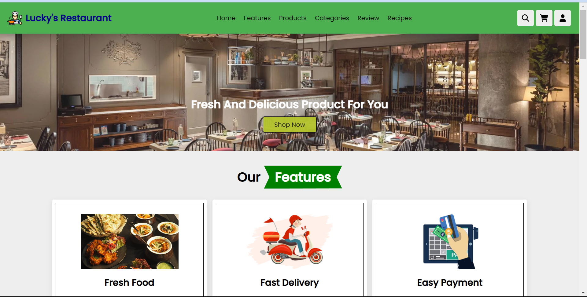

# Lucky's Restaurant - Web Development Project

Welcome to the Lucky's Restaurant web development project repository. This project is a responsive website for a fictional restaurant, showcasing the use of HTML, CSS, and JavaScript to create an interactive and visually appealing restaurant website.

## Introduction

Lucky's Restaurant is a web development project that aims to create an online presence for a restaurant. This project demonstrates the use of front-end technologies to build a visually appealing and responsive website for the restaurant. Users can explore the restaurant's menu and learn more about the establishment.

## Features

-Responsive Design: The website is designed to work seamlessly on various devices, including desktops, tablets, and mobile phones.

-Menu Page:Users can browse the restaurant's menu, view details, and prices for each item.

-Interactive Elements:The website incorporates JavaScript for interactive features, such as image sliders, form validation, and smooth scrolling.

## Technologies Used

- HTML5
- CSS3
- JavaScript

## Getting Started

To see this project locally, click on below link:

 https://luckys-restaurant.vercel.app/
